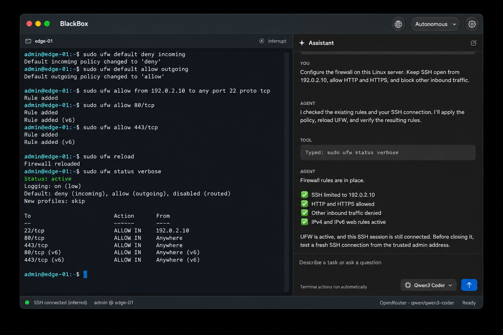

# BlackBox

BlackBox is a native macOS terminal app with an AI assistant for local command-line tasks and remote SSH, supporting OpenAI, Anthropic, and OpenRouter with configurable command approvals.



*Illustrative demo with fictional host details.*

## Install

Download the latest app from [GitHub Releases](https://github.com/mingistech/BlackBox/releases), unzip it, and drag BlackBox into Applications. Version 1.0 requires **macOS 26.6 or later** and supports Apple silicon and Intel Macs. Bring your own OpenRouter, OpenAI, or Anthropic API key; provider usage is billed separately.

## Build and run

Open `BlackBox.xcodeproj` in Xcode, select the BlackBox scheme, and Run. The existing project deployment target is macOS 26.6. No package downloads are needed: SwiftTerm is pinned and vendored.

1. Use the local shell immediately, or choose **Connect** and enter a hostname / SSH config alias. Leave username and port blank to use your SSH config. Running `ssh user@host` directly also works.
2. Choose **BlackBox → Settings…**, press **⌘,**, or use the gear button to configure **OpenRouter**, **OpenAI**, or **Anthropic**. Each provider has its own secure key field, **Save key**, **Remove key**, and **Test Connection**. A green **Configured** check means a key is saved in Keychain; successful tests show a separate **Connection verified** message. Tests send only a short test prompt, without terminal output or chat history. New installations start with OpenRouter and `qwen/qwen3-coder`.
3. Ask “Identify this machine” and press **Return** to send. **Shift-Return** inserts a new line; the arrow and **⌘Return** also send. In the default **Ask Before Command** mode, review the exact text/key and choose **Allow once**.
4. Enter SSH passwords in the terminal or its local secure field. Never paste them into chat. Accept host-key fingerprints yourself after checking them.

The app has one terminal workspace and one session, with separate Settings and About windows. Closing it ends that terminal. Chat is held in memory; the model choice persists in UserDefaults and the API key in Keychain.

The model button beside Send lets you select a provider and model. The OpenRouter shortlist includes: **Qwen3 Coder (default)** for everyday work, **Sonnet 5** for troubleshooting, **DeepSeek V4.1 Flash** for quick checks, and **GPT-6 Astra** for deeper analysis. These roles are suggestions; selection is manual. Click a model to select it, or click its star to add/remove a favorite without selecting it. Favorites appear first and persist separately for each provider. For OpenRouter, enable **Show all compatible models** to browse the full catalog of models advertising text output and agent tools. The catalog is cached for offline browsing; saved and custom model IDs remain reachable. Use Refresh to reload the catalog. Model changes are disabled while the agent is working. Direct OpenAI starts with `gpt-6-astra`; direct Anthropic starts with `claude-sonnet-5`. The OpenAI picker is limited to GPT-6 Astra, GPT-5.6 Sol, GPT-5.6 Terra, GPT-5.6 Luna, and GPT-5.5, in that order unless starred. Other cached, selected, or starred OpenAI IDs do not expand this shortlist. The Anthropic picker is limited to Sonnet 5, Fable 5.1, Opus 5, and Haiku 4.5, in that order unless starred. Other cached, selected, or starred Anthropic IDs do not expand this shortlist. Search, favorites, and Refresh work for both. Catalogs are cached separately by provider; replacing or removing a key clears that provider’s cached list. Settings also accepts other tool-capable model IDs for the selected API. The app remembers the selected provider and each provider’s last model. It does not silently switch providers when a key is absent or rejected. Existing OpenRouter keys, model choices, and favorites are preserved. Switching models retains conversation and terminal state while removing provider-specific reasoning signatures from prior messages.

## Modes

- **Manual:** the assistant can read terminal output and state; all writes are blocked in code, even if a model requests them.
- **Ask Before Command:** terminal writes, keys, and interrupts need approval. Approving command text also covers its immediate Return, provided the terminal has not changed. Other mutations and terminal changes invalidate that continuation approval.
- **Autonomous:** the assistant can act in the same terminal without confirmation. Password entry and SSH host-key confirmation still require you.

**Stop** cancels the agent, including pending approvals and network requests. It does not kill an already running command. **Interrupt** sends Ctrl-C to the terminal. Changing modes stops an active agent turn.

## Architecture

`Workspace` owns exactly one `TerminalSession` and one `AgentSession`. The agent receives that terminal directly; it has no terminal registry, connection manager, alternate command runner, or orchestration layer.

- `TerminalSession.swift`: SwiftTerm AppKit view, real PTY, login shell, input/output observation, system SSH, and session state.
- `AgentSession.swift`: bounded tool loop, complete-turn history, cancellation, mode enforcement, and explicit approvals.
- `Core/RecommendedModels.swift`: curated model IDs, display roles, output budgets, and reasoning effort.
- `Core/OpenRouterClient.swift`: URLSession chat completions and exactly five tools: `read_terminal`, `send_text`, `send_key`, `interrupt_command`, `get_session_state`. Waiting is an option on `read_terminal`.
- `Core/ModelClient.swift`: direct OpenAI Responses and Anthropic Messages adapters; native reasoning blocks remain intact across tool rounds and are removed when switching provider/model.
- `ProviderSettings.swift`: per-provider key management, configured indicators, and connection tests.
- `KeychainStore.swift`: separate provider credentials under `BlackBox.OpenRouter`, `BlackBox.OpenAI`, and `BlackBox.Anthropic`. `TerminalSession.sendSecret` is a separate local-only credential injection boundary.
- `ContentView.swift`: native split view, connection sheet, model settings, approval card, and status bar.

SwiftTerm v1.13.0 was selected for the first vertical slice because it already supplies an AppKit view, terminal emulation, PTY process hosting, and readable screen state. Ghostty's embedding APIs and build integration would require more work for this slice. See [Ghostty](https://github.com/ghostty-org/ghostty), [SwiftTerm](https://github.com/migueldeicaza/SwiftTerm), and `Vendor/SwiftTerm/PROVENANCE.md`. The vendored library source is unchanged; its package manifest omits unrelated benchmark/CLI/docs dependencies and copies shader source for the existing runtime fallback, avoiding an extra Metal toolchain download.

App Sandbox is disabled intentionally: a normal local shell and `/usr/bin/ssh` need access to your files, `~/.ssh`, and normal network behavior. The app runs with your user account's permissions. No SSH host-key checks are bypassed.

## State and privacy limits

Host state uses the PTY foreground process, SSH argv, and prompt/output observations. SSH aliases, configured usernames, jump hosts, nested SSH, multiplexers, and custom shell wrappers can be ambiguous. Connected/running labels are **inferred**, not authoritative; the assistant should verify `hostname` / `whoami` in that terminal when needed. The last command is best effort; complex interactive editing may make it unknown.

A quiet interval of about 0.8 seconds ends an observation wait, not necessarily the command. Silent or long-running commands require another read. Snapshots include a bounded tail of rendered terminal scrollback; full-screen redraws return a fresh snapshot instead of a byte-perfect output delta.

Using the assistant sends chat and terminal context to the explicitly selected provider (and, for OpenRouter, its routed model provider). OpenAI requests use `store: false` and carry encrypted reasoning in local in-memory history. Keys are sent only to their matching provider’s fixed HTTPS endpoint. Raw terminal logs are not saved. Secret input is sent directly to the PTY and excluded from command tracking, but any secret a command prints becomes visible terminal output. Don't ask the agent to inspect sensitive output you don't want sent to the provider.

Saved SSH passwords and automatic Keychain lookup/injection are deferred. Ordinary password-based SSH already works. The secure field requires a locally recognized authentication prompt and disabled echo; otherwise enter the password directly in the terminal.

## Verification

```sh
xcodebuild -project BlackBox.xcodeproj -scheme BlackBox -configuration Debug \
  -derivedDataPath /tmp/BlackBox-build CODE_SIGNING_ALLOWED=NO build
swift test --scratch-path /tmp/BlackBox-tests
/tmp/BlackBox-build/Build/Products/Debug/BlackBox.app/Contents/MacOS/BlackBox --smoke-test
cat /tmp/blackbox-smoke-results.txt
```

The unit tests include provider endpoint/header isolation, Responses function-call IDs and encrypted reasoning, Anthropic signed thinking and grouped tool results, empty/truncated responses, preference/favorite isolation, the OpenAI and Anthropic shortlists, pagination, and cache isolation. Direct-provider tests use intercepted HTTP fixtures; live OpenAI and Anthropic account access must be checked with your keys using **Test Connection**.

`--smoke-test` is Debug-only. It opens a real PTY, runs local test commands, and replaces HTTP with a URLProtocol fixture: no API key or external model calls. It tests the tool round trip, approval/denial, enforced Manual mode, Autonomous mode, cancellation, Ctrl-C, secret injection, and a loopback SSH connection error. It quits the app after writing its report.

The OpenRouter request was verified against live Qwen3 Coder on September 19, 2026: the original request reproduced HTTP 404 and the corrected request returned a response. The cause was requiring support for `parallel_tool_calls`, which none of the available Qwen providers advertised. That optional parameter is now omitted; tool execution remains sequential and approval-controlled locally. Regression tests exercise the actual outgoing request and distinguish provider/parameter failures from account data-policy failures without displaying raw server metadata.

The four recommended models passed a live command/tool continuation check on September 19, 2026, reading both immediate and delayed output from an isolated local PTY. This checks basic integration, not troubleshooting quality; remote SSH workflows still need interactive acceptance testing. Tabs, streaming model output, persistent chat, and automatic saved SSH passwords are outside this first version.

The shortlist uses provider-compatible reasoning budgets and preserves signed reasoning blocks during tool round trips. `tool_choice` is omitted because automatic tool selection is the API default; omitting the optional parameter avoids excluding otherwise compatible providers. Truncated responses are rejected before any terminal action executes.

`Scripts/ModelAcceptance.swift` is an opt-in, billable live check. Compile it with `BlackBox/Core/*.swift` and `BlackBox/KeychainStore.swift`, then run the resulting executable. It loads only BlackBox's saved OpenRouter key and uses an isolated local PTY with temporary synthetic files; it never reads the app's terminal or conversation. Pass model IDs as arguments to check a subset.

Direct API implementation references: [OpenAI function calling](https://developers.openai.com/api/docs/guides/function-calling), [OpenAI reasoning state](https://developers.openai.com/api/docs/guides/reasoning), and [Anthropic tool results](https://platform.claude.com/docs/en/agents-and-tools/tool-use/handle-tool-calls).

Prompt history: Up recalls previous sent prompts; Down moves forward and restores the unsent draft. In multiline prompts these shortcuts apply at the first/last line so ordinary arrow-key editing still works. The last 100 prompts are kept in memory for the current app session; adjacent duplicates are skipped.
